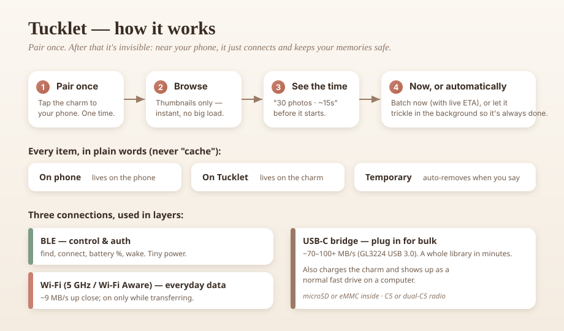

# Tucklet

**A pocket-sized companion drive that clips to your phone like a charm and holds your memories — no data cable, no babysitting, no clutter.**

Tucklet is a small, battery-powered, wireless storage device. After a one-time
pairing, your phone recognizes it automatically — no button press in daily use —
and your photos and videos move on and off it through a clean app that never
makes you think about "caches" or "sync states." It is designed to disappear
into your daily carry, and to be usable by someone who has never thought about
storage in their life.



> **Status:** Engineering foundation, organized for build. The architecture,
> protocol, per-variant hardware design, mechanical model, and the shared
> firmware/app core are complete and (where they can be) compiled and tested.
> The on-device firmware binary and the native apps build on this foundation —
> see [Build status](#build-status).

---

## What it is

| | |
|---|---|
| **Storage** | **microSD** (swappable) or **eMMC** (sealed) — your choice of variant. |
| **Radio** | **ESP32-C5** (Wi-Fi 6 + BLE) in Standard or Mini form factors; **ESP32-E22** (Wi-Fi 6E) roadmap. |
| **Control link** | **BLE** — discovery, auth, battery %, wake. Low power, always cheap. |
| **Wireless data** | **Wi-Fi** (SoftAP universally; **Wi-Fi Aware** seamlessly where certified). On only while transferring. |
| **Wired data** | **USB-C → GL3224 USB 3.0 bridge** — ~70–100+ MB/s (USB 3.0); USB 2.0 fallback via GL823 at ~25–35 MB/s; also charges. |
| **Security** | Invisible after a one-time pairing: silent low-duty BLE, cryptographic challenge-response, physical-press to enroll a *new* phone. |

## The experience

- **Plain-language state, never jargon:** **On phone / On Tucklet / Temporary** — the word "cache" never appears.
- **You set how long "Temporary" lasts** (1 hour / 1 day / 1 week / keep).
- **Round-trip metadata:** files remember their origin album/app so "put it back" restores them exactly.
- **Per-app organization** by default; a friendly folder view for power users, never forced.
- **Honest transfer time:** every transfer shows an estimate before it starts and a live ETA while it runs.
- **Trickle backup:** new photos back up automatically when the charm is near and idle, so the big transfer never has to happen.

Full detail in [`docs/UX_SPEC.md`](docs/UX_SPEC.md).

## Repository layout

```
tucklet/
├── README.md                  # you are here
├── LICENSING.md               # which license covers what (source-available, non-commercial for Charm; Pro is separate)
├── LICENSE-HARDWARE.txt        # CC BY-NC-SA 4.0 (hardware/mechanical — Charm variants only)
├── LICENSE-SOFTWARE.txt        # PolyForm Noncommercial 1.0.0 (firmware/apps — Charm variants only)
├── docs/
│   ├── INDEX.md               # documentation map — start here to navigate
│   ├── FINAL_REVIEW.md        # current source of truth (supersedes ADRs)
│   ├── VARIANT_MATRIX.md      # every build configuration, one codebase
│   ├── TRANSFER_PERFORMANCE.md, UX_SPEC.md, POWER_THERMAL.md, PRIOR_ART_AND_LICENSE.md
│   ├── adr/                   # original decision records (history)
│   ├── protocol/PROTOCOL.md   # the wire contract (mirrored by tucklet-proto)
│   └── assets/flow.svg
├── hardware/
│   ├── README.md              # hardware overview + how the variants relate
│   ├── PRO_LINE.md            # Pro line (E22-WROOM + 2S) — commercial, not under NC license
│   ├── gen_hardware.py        # parametric SOURCE — regenerates every variant
│   ├── common/                # shared parts rationale, cross-variant comparison, block diagram
│   └── variants/              # one folder per board: SPEC, BOM, PIN_MAP, SCHEMATIC_PLAN, .net, diagram
│       # C5 Standard (WROOM)
│       ├── singlec5-wroom-microsd/
│       ├── singlec5-wroom-emmc/
│       ├── dualc5-wroom-microsd/
│       ├── dualc5-wroom-emmc/
│       # C5 Mini (Compact)
│       ├── singlec5-mini-microsd/
│       ├── singlec5-mini-emmc/
│       ├── dualc5-mini-microsd/
│       ├── dualc5-mini-emmc/
│       # E22 Mini (Roadmap/Future)
│       ├── singlee22-mini-microsd/
│       ├── singlee22-mini-emmc/
│       ├── duale22-mini-microsd/
│       └── duale22-mini-emmc/
├── firmware/                  # Rust workspace (tucklet-proto + tucklet-core compile + tested)
├── software/ios/              # iOS companion app (SwiftUI + File Provider)
├── software/android/          # Android app (Kotlin + Jetpack Compose)
├── software/desktop/          # Desktop: USB-drive when wired + wireless companion (Rust core/CLI + Tauri GUI)
└── mechanical/                # parametric enclosure (renders STLs for both envelopes)
```

## Start here

1. [`docs/INDEX.md`](docs/INDEX.md) — the full documentation map.
2. [`docs/FINAL_REVIEW.md`](docs/FINAL_REVIEW.md) — the load-bearing decisions, current.
3. [`hardware/README.md`](hardware/README.md) — the board variants and how to build them in KiCad.
4. [`docs/protocol/PROTOCOL.md`](docs/protocol/PROTOCOL.md) — the contract that keeps firmware and apps in sync.

## Build status

What is **compiled and tested** here (run `cargo test` in `firmware/`):

- `firmware/crates/tucklet-proto` — every wire type (variant matrix, states, origin metadata, transfers). *5 tests.*
- `firmware/crates/tucklet-core` — device brain: estimator, link profiles, state machine, trickle scheduler, **session credentials**, Temporary expiry, allow-list, transport resolution. *16 tests.*

What is **complete and verified to render**: the parametric hardware (**12 Charm-optimized variants**, all netlists validated), the enclosure (renders watertight STLs for both envelopes), and all design docs.

What **builds on this foundation and needs on-hardware/SDK bring-up**: the
on-device ESP32-C5 firmware binary and the native apps (iOS present; Android +
desktop next). Those can't be compiled in CI here against the C5 toolchain and
the iOS 26 SDK, so they are written real and complete with the exact
SDK-confirmation points flagged rather than guessed. See `docs/INDEX.md` for the
current state of each.

## The two product lines

Tucklet is organized as two distinct product lines with separate licensing:

### Charm (source-available, non-commercial)

The AirTag-class wearable. All 12 generated variants (C5 WROOM/MINI, E22-MINI
roadmap) fall under this line. Licensed under **CC BY-NC-SA 4.0** (hardware)
and **PolyForm Noncommercial 1.0.0** (software). You may study, modify, and
build for personal use; commercial sale requires a separate agreement.

Key components in the Charm line:
- **USB-HS Bridge:** GL3224-OEM (QFN-32, USB 3.0, ~70–100+ MB/s wired). Backup: GL823 (QFN-24, USB 2.0, ~25–35 MB/s).
- **Charger:** BQ25896 (WQFN-24, power-path buck charger, I²C). Backup: MCP73831 (SOT-23-5, simple linear, no power-path).
- **Fuel Gauge:** MAX17048 (TDFN-8, ModelGauge, no sense resistor).
- **SD Bus Mux:** TS3A-class (QFN-20). Upgrade path: TMUX1574 for signal integrity.
- **Dual-Radio AGG Link:** SPI (4 wires: CLK, CS, MOSI, MISO) for 12–15 MB/s sustained on dual variants.
- **Battery:** 1S LiPo (120–200 mAh for C5; 300–500 mAh for E22).

### Pro (commercial, not under the NC license)

A larger, higher-performance variant built around the **ESP32-E22-WROOM** (Wi-Fi 6E,
22×30 mm module with external IPEX antenna) and a **2S LiPo** battery pack.
This requires a larger enclosure (~35×28×12–13 mm) and is not part of the
source-available, non-commercial license grant. The Pro design IP is documented
in [`hardware/PRO_LINE.md`](hardware/PRO_LINE.md) for provenance and future
commercial use, but it is **explicitly excluded** from the CC BY-NC-SA /
PolyForm NC grant.

Key differences for Pro:
- **Charger:** BQ25887 (2S boost + cell balancing).
- **Fuel Gauge:** BQ27421 or BQ27520 (Impedance Track, requires sense resistor).
- **Buck Regulator:** Sized for 8.4V input (2S) → 3.3V output at ≥2A.
- **Battery:** 2S LiPo (~120–150 mAh, ~6 mm thick).
- **Enclosure:** ~35×28×12–13 mm (breaks AirTag class; justified by performance).

## License

Dual, **source-available, non-commercial** for the **Charm** line (study/modify/build, don't sell):
hardware under CC BY-NC-SA 4.0, software under PolyForm Noncommercial 1.0.0. This
is *not* an OSI/GNU "open source" license — see [`LICENSING.md`](LICENSING.md).

The **Pro** line (E22-WROOM + 2S battery) is documented in this repository for
design provenance but is **not licensed** under the above terms. Commercial use
of the Pro design requires a separate agreement with the project maintainer.

### Hardware scope & novelty

The Hardware License (CC BY-NC-SA 4.0) applies to the specific implementation files
(schematics, PCB layouts, netlists, and mechanical models) contained in this
repository for the **Charm** product line. Specifically, the license covers the
following novel design elements:

1. **SDIO Bus Multiplexing Architecture:** The specific circuit topology where the
   SDIO storage bus is arbitrated between a Wi-Fi radio (ESP32-C5/E22) and a
   dedicated USB-HS Bridge (U2) via a hardware mux (U6), enabling seamless
   switching between wireless and high-speed wired modes without user intervention.
2. **Dual-Radio SPI Link Aggregation Topology:** The unique placement, antenna
   isolation strategy, and inter-processor SPI communication (AGG link) design
   required to fit two ESP32 radios in a "Charm" form factor for aggregated
   throughput.
3. **Integrated Charm Enclosure:** The parametric mechanical design that integrates
   a battery, antenna, storage, and thermal management into an AirTag-class envelope.

**Note on Patents:** This license covers the *artistic and functional design files*
(Copyright). It prevents others from copying your PCB layouts or manufacturing
your exact design commercially. It does not prevent others from independently
inventing similar circuits (which would require a Patent). However, by publishing
these designs under a Non-Commercial license, you ensure that no one can legally
clone the *Tucklet hardware* for sale without your permission.

---

*"Tucklet" is a working product name (verified clear vs. the taken "Locket"/"Tuckit"). Trademark-check class 9 before commercial use.*
